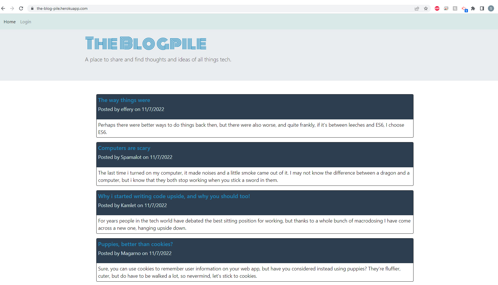

#  Module 14 : The Blog Pile - CMS Blog Site 

## Overview

I have CMS-style blog site  for users to sign up to, or log in, and log blog posts comments to share with other users.

## Installation

N/A

## Usage

The site can be accessed via its [Heroku deployment](https://the-blog-pile.herokuapp.com/) and can be accesses using any of the existing accounts below, or a newly registered user.
```
username: effery, password: blageron
username: E_Krantz, password: evilempire
username: Spamalot, password: 244466666
```
Non logged in users can view blog posts on the main pag ebut to view or add comments, or add posts, the user will have to log in. The user can also edit or delete their own posts.



### Links

 [Github Repo](https://github.com/sashdc/The-Blog-Pile)
 
 [Heroku Deployment](https://the-blog-pile.herokuapp.com/)

 ## Credits

Cherian, Saharsh

[Creator Github](https://github.com/sashdc)

## License

N/A